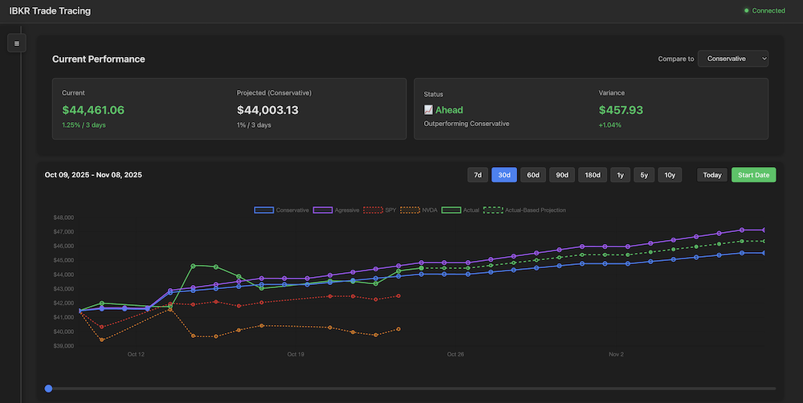

# IBKR Trade Tracing

A full-stack application for tracking and visualizing trade performance with Interactive Brokers integration.



## Features

- **Manual Trade Tracking**: Create custom trade projections and track actual vs projected performance
- **IBKR Integration**: Connect to your Interactive Brokers account to automatically import portfolio positions
- **Real-time Portfolio Updates**: Live Server-Sent Events stream for instant portfolio updates from IBKR
- **Visual Analytics**: Chart.js powered visualizations comparing projected vs actual performance
- **Flexible Date Ranges**: Filter and view data across custom time periods
- **Hybrid Approach**: Mix manual entries with automated IBKR data

## Architecture

### Frontend
- React 18 + TypeScript
- Vite for fast development
- Chart.js for data visualization
- Server-Sent Events for real-time updates
- Custom `useIBKRStream` hook with automatic reconnection
- Local storage for data persistence

### Backend
- Node.js + Express
- TypeScript
- @stoqey/ib for Interactive Brokers API integration
- Server-Sent Events (SSE) for real-time portfolio updates
- Event-driven architecture with EventEmitter

## Prerequisites

1. **Node.js**: Version 18 or higher
2. **Interactive Brokers Account** (for IBKR features)
3. **TWS or IB Gateway**: Must be running and configured for API access

## Installation

### 1. Clone or navigate to the project

```bash
cd /Users/tavram/Projects/ibkr-tracing
```

### 2. Install Backend Dependencies

```bash
cd backend
npm install
```

### 3. Install Frontend Dependencies

```bash
cd ../frontend
npm install
```

### 4. Configure Backend Environment

Create a `.env` file in the `backend` directory:

```bash
cd ../backend
cp .env.example .env
```

Edit `.env` with your settings:

```env
# IBKR Connection Settings
IBKR_HOST=127.0.0.1
IBKR_PORT=7497          # 7497 for TWS, 4002 for Gateway (paper), 4001 for Gateway (live)

# Server Settings
PORT=3001
NODE_ENV=development

# CORS Settings
FRONTEND_URL=http://localhost:5173
```

## IBKR TWS/Gateway Setup

### 1. Install TWS or IB Gateway

Download from [Interactive Brokers](https://www.interactivebrokers.com/en/trading/tws.php)

### 2. Enable API Access

1. Open TWS or IB Gateway
2. Go to **File → Global Configuration → API → Settings**
3. Check **Enable ActiveX and Socket Clients**
4. Note the **Socket Port** (usually 7497 for TWS, 4001/4002 for Gateway)
5. Add **127.0.0.1** to **Trusted IP Addresses**
6. Uncheck **Read-Only API** if you want to place orders (not required for tracking)
7. Click **OK** and restart TWS/Gateway

### 3. Important Notes

- **Paper Trading**: Use port 4002 for paper trading accounts via IB Gateway
- **Live Trading**: Use port 4001 for live accounts via IB Gateway
- **TWS**: Use port 7497 (or check your configuration)
- **Client ID**: Must be unique for each connection (0-32)

## Running the Application

### Development Mode

Open two terminal windows:

**Terminal 1 - Backend:**
```bash
cd backend
npm run dev
```

**Terminal 2 - Frontend:**
```bash
cd frontend
npm run dev
```

The application will be available at:
- Frontend: http://localhost:5173
- Backend API: http://localhost:3001

### Production Build

**Backend:**
```bash
cd backend
npm run build
npm start
```

**Frontend:**
```bash
cd frontend
npm run build
npm run preview
```

## Usage

### 1. Connect to IBKR

1. Ensure TWS or IB Gateway is running
2. Open the app at http://localhost:5173
3. In the IBKR Connection panel, click "Show Settings"
4. Enter your connection details:
   - Host: 127.0.0.1
   - Port: 7497 (or your configured port)
   - Client ID: 1 (or any unique number 0-32)
5. Click "Connect to IBKR"

### 2. Import Portfolio Positions

1. Once connected, click the "IBKR" button in the sidebar
2. Click "Refresh Portfolio" to load your positions
3. Select a position and click "Create Tracker"
4. The tracker will be created with your current market value as the starting point

### 3. Manual Tracker Creation

1. Click the "+" button in the sidebar
2. Fill in the investment details:
   - Name (optional)
   - Starting Amount
   - Projected Increase Percentage
   - Interval (in days)
   - Start Date
   - End Date
3. Click "Create Tracker"

### 4. Track Performance

- View projected vs actual performance on the chart
- Update actual values manually using the "Update Actual Amount" section
- Adjust date ranges to focus on specific periods
- Modify end dates to extend tracking periods

## API Endpoints

### IBKR Endpoints

- `POST /api/ibkr/connect` - Connect to IBKR TWS/Gateway
- `POST /api/ibkr/disconnect` - Disconnect from IBKR
- `GET /api/ibkr/status` - Get connection status
- `GET /api/ibkr/stream` - Server-Sent Events stream for real-time account and portfolio updates
- `GET /api/ibkr/historical/:symbol` - Get historical data for a symbol
- `GET /api/ibkr/config/defaults` - Get default IBKR connection configuration

### Health Check

- `GET /api/health` - Server health check

## Troubleshooting

### Cannot connect to IBKR

- Ensure TWS or IB Gateway is running
- Check that API access is enabled in TWS/Gateway settings
- Verify the port number matches your configuration
- Make sure 127.0.0.1 is in the trusted IP addresses
- Try a different Client ID (0-32)

### Port already in use

- Change the PORT in backend/.env
- Update FRONTEND_URL in backend/.env if needed
- Update the proxy settings in frontend/vite.config.ts

### CORS errors

- Verify FRONTEND_URL in backend/.env matches your frontend URL
- Check that the backend server is running

### No positions showing

- Ensure you have open positions in your IBKR account
- Try disconnecting and reconnecting
- Check the backend console for error messages

## Development

### Backend Development

```bash
cd backend
npm run dev        # Start with hot reload
npm run build      # Build TypeScript
npm run lint       # Run ESLint
```

### Frontend Development

```bash
cd frontend
npm run dev        # Start Vite dev server
npm run build      # Build for production
npm run lint       # Run ESLint
npm run preview    # Preview production build
```

## License

MIT

## Support

For issues or questions:
1. Check the IBKR API documentation: https://www.interactivebrokers.com/campus/ibkr-api-page/
2. Review the @stoqey/ib library: https://github.com/stoqey/ib
3. Check TWS/Gateway logs for connection issues

## Disclaimer

This application is for educational and tracking purposes only. It is not financial advice. Always verify data independently and consult with financial professionals before making investment decisions.
